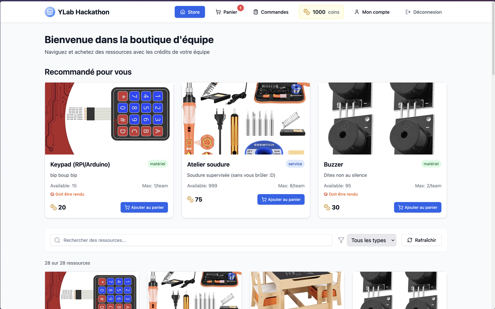
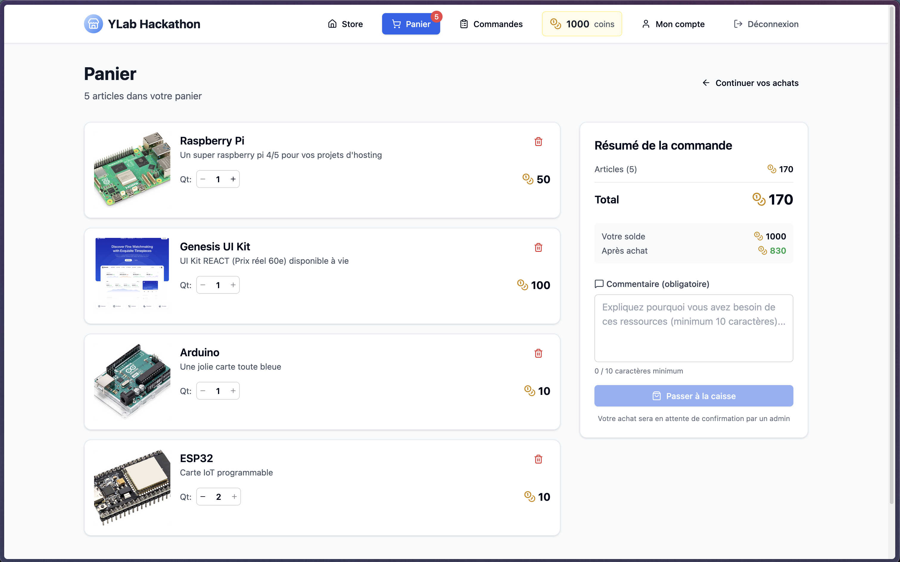

# YLab Hackathon



YLab shop is a all in one plateform to manage a virtual shop during a Hackathon event. Each team has a budget to spend in the shop to buy services, tools, and resources to help them with their projects. The shop is designed to be user-friendly and efficient, allowing teams to quickly find and purchase what they need.

It's written with a Go backend and a React frontend. It makes it easy to deploy and maintain, not heavy on resources, and scalable to handle a large number of teams and requests.

---

The plateform also includes an admin interface for the Hackathon organizers to handle the shop requests (accept, partially accept, refuse) and manage the inventory of items rented in order to have a way to track what has been rented and by whom.
It also gives basic tools to manage the creation of teams (when you don't know the amount of students that will come...)



## Features

- All-in-one shop management system for Hackathon events
- User-friendly interface for teams to browse and purchase items
- Admin interface for organizers to manage requests and inventory
- Budget tracking for each team
- Tool to manage and fill teams when not known in advance

## Installation

YLab Shop is hosted as a GHCR image. You can pull the latest version with the following command:

```bash
docker pull ghcr.io/hackathon-ynov/ylab-shop:latest-amd64
```

Fill the `.env.example` file with your own configuration and rename it to `.env`.

Then run the container with the following command:

```bash
docker compose up -d
```

## Version

The app is currently in version 1.0.0 after being written in 1 week just for the Toulouse Ynov Hackathon 2025.
